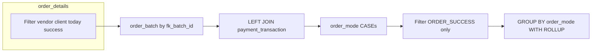

# Learning: VoucherGram daily orders — batch rollup by payment mode

This note documents a Metabase/native-SQL style query that summarizes **today’s successful VoucherGram orders** by **payment mode** (pure coin, pure PG, hybrid), with a **grand total** row via `GROUP BY … WITH ROLLUP`.

The query is **not** executed by this repository; it is **reference documentation** for analysts and for reuse in Metabase questions.

---

## 1. Business intent

- **Who**: Orders where `vendor = 'VOUCHAGRAM'`, from selected **clients** (BharatPe UPI variants), **not** created via an automated `order_created_by` path (`IS NULL`).
- **When**: Rows whose **calendar date** of `created_at` equals **today** (`DATE(created_at) = CURRENT_DATE`).
- **What success means**: Base filter uses `order_status = 'ORDER_SUCCESS'`, then the second CTE can **override** a batch to cancelled if the linked payment transaction is cancelled.
- **Grain**: One logical **order batch** per `fk_batch_id` (aggregated from `order_details`).
- **Output**: For each **order_mode** (and a **TOTAL** row), counts of distinct batches and distinct users (LCN), plus a **rupee-like amount** that mixes cash and points with a fixed points-to-INR rule.

---

## 2. Tables involved (inferred)

### `order_details` (line-level or detail rows per batch)

Consolidated inferred column catalog: [learnings-order-details-schema.md](./learnings-order-details-schema.md).

| Column / expression | Role in this query |
|---------------------|-------------------|
| `fk_batch_id` | Groups multiple detail rows into one **order batch**. |
| `cash_paid` | Cash / PG component; summed per batch. |
| `point_used` | Points redeemed; may be null. |
| `total_points` | Fallback when `point_used` is null (`COALESCE(point_used, total_points)`). |
| `lcn_id` | **User** identifier at detail level; `MIN(lcn_id)` picks one LCN per batch (assumes one user per batch). |
| `created_at` | Timestamp; filtered to today; `MIN(created_at)` as batch time (representative). |
| `order_status` | `MIN(order_status)` per batch — only safe if status is homogeneous within a batch. |
| `vendor` | Filter: `'VOUCHAGRAM'`. |
| `client` | Filter: `IN ('BharatPe UPI', 'BharatPe_UPI', 'BharatPe')`. |
| `order_created_by` | Filter: `IS NULL` (excludes system/API-created rows, per naming). |

### `payment_transaction`

| Column | Role in this query |
|--------|-------------------|
| `order_batch_id` | Join key to `order_batch.fk_batch_id`. |
| `transaction_status` | If `'CANCELLED'`, the batch is treated as **`ORDER_CANCELLED`** in the outer logic. |

**Join**: `LEFT JOIN` so batches **without** a matching payment row still appear; their status stays the batch status from `order_batch`.

---

## 3. CTE: `order_batch`

**Purpose**: Collapse `order_details` to **one row per `fk_batch_id`** for the filtered slice.

**Aggregations**:

- `SUM(cash_paid)` → total cash for the batch.
- `SUM(COALESCE(point_used, total_points))` → total points for the batch, using `total_points` when `point_used` is null.
- `MIN(lcn_id)` → single LCN for the batch (documented assumption: one customer per batch).
- `MIN(created_at)` → earliest detail timestamp in the batch.
- `MIN(order_status)` → one status value per batch (**fragile** if mixed statuses exist within the same batch).

**Filters** (all in `WHERE`):

- Vendor and client constraints.
- Today only.
- `order_status = 'ORDER_SUCCESS'` at row level before aggregation.
- `order_created_by IS NULL`.

---

## 4. CTE: `order_mode`

**Purpose**: Attach payment outcome and **classify** how the batch was paid.

### 4.1 Effective status (`order_status` column in this CTE)

```text
CASE WHEN pt.transaction_status = 'CANCELLED' THEN 'ORDER_CANCELLED' ELSE status END
```

- `status` here is the `MIN(order_status)` from `order_batch` (expected `'ORDER_SUCCESS'`).
- Any batch whose joined `payment_transaction` is **cancelled** is relabelled **`ORDER_CANCELLED`** for downstream filtering.

**Edge cases**:

- Multiple `payment_transaction` rows per `order_batch_id`: the query does not deduplicate; join semantics depend on the database (e.g. one row per batch vs duplicate rows — duplicates can skew results).
- No payment row: `pt.transaction_status` is null → not `'CANCELLED'` → keeps `status`.

### 4.2 `order_mode` (payment mix)

```text
CASE
  WHEN ob.cash_paid = 0 THEN 'PURE COIN'
  WHEN ob.point_used = 0 THEN 'PURE PG'
  ELSE 'HYBRID'
END
```

**Important**: `order_mode` uses **`ob.cash_paid` and `ob.point_used`** — the **summed** batch totals from `order_batch`, not the raw line columns after the join.

- **PURE COIN**: No cash component in the batch total.
- **PURE PG**: No points component in the batch total (`point_used` sum is exactly 0).
- **HYBRID**: Both cash and points contribute.

**Subtlety**: `point_used` in `order_batch` is `SUM(COALESCE(point_used, total_points))`. So “pure PG” means that **sum is 0**, not merely “column null on all lines.”

---

## 5. Final `SELECT`: metrics and `WITH ROLLUP`

**Filter**: `WHERE order_status = 'ORDER_SUCCESS'` — drops batches relabelled to **`ORDER_CANCELLED`** after the payment join.

**Dimensions**:

- `COALESCE(order_mode, 'TOTAL') AS order_mode` — in a `ROLLUP`, the **super-aggregate** row has `order_mode` NULL; this displays it as **`TOTAL`**.

**Measures**:

| Measure | Definition |
|---------|------------|
| `total_orders` | `COUNT(DISTINCT fk_batch_id)` — distinct batches in the group. |
| `unique_users` | `COUNT(DISTINCT lcn)` — distinct `lcn_id` values (from `MIN(lcn_id)` per batch, so effectively distinct batches’ chosen LCN). |
| `total_amount_inr` | `ROUND(SUM(cash_paid + point_used / 4))` |

**Points-to-INR rule**: Points are divided by **4** before adding to `cash_paid`. That implies an internal **conversion rate** (e.g. 4 points ≈ ₹1) — this is **business logic**, not a universal Metabase rule. Confirm with product/finance before reusing.

**`GROUP BY order_mode WITH ROLLUP`**: Produces one row per `order_mode` plus one **subtotal** row where grouping columns are null (here coalesced to `'TOTAL'`).

**`ORDER BY`**:

1. `CASE WHEN order_mode IS NULL THEN 1 ELSE 0 END` — puts the rollup **total** row after detail rows (because in raw output the super-aggregate still has NULL `order_mode` before `COALESCE` in the select list ordering… **Note**: In standard SQL, `ORDER BY` typically refers to **output** column aliases depending on the engine; verify on your warehouse.)
2. Then `order_mode` for stable ordering of mode rows.

*(If your database evaluates `ORDER BY` before the `SELECT` alias is visible, you may need to repeat the `COALESCE` expression or use a subquery.)*

---

## 6. End-to-end flow (mental model)



---

## 7. Checklist before reusing in Metabase

- [ ] Confirm **`DATE(created_at) = CURRENT_DATE`** matches your timezone expectations (DB session vs IST vs UTC).
- [ ] Validate **`MIN(order_status)`** and **`MIN(lcn_id)`** per batch against real duplicates/mixed states.
- [ ] Confirm **one** payment row per batch or adjust join (e.g. `DISTINCT`, `MAX`/`MIN` on transaction, or filter latest).
- [ ] Align **`point_used / 4`** with official points valuation.
- [ ] Test `ORDER BY` with your SQL dialect (alias visibility).

---

## 8. Source query (verbatim reference)

```sql
WITH order_batch AS (
    SELECT 
        fk_batch_id,
        SUM(cash_paid) AS cash_paid,
        SUM(COALESCE(point_used, total_points)) AS point_used,
        MIN(lcn_id) AS lcn,
        MIN(created_at) AS created_at,
        MIN(order_status) AS status
    FROM order_details
    WHERE vendor = 'VOUCHAGRAM'
      AND DATE(created_at) = CURRENT_DATE
      AND order_status = 'ORDER_SUCCESS'
      AND client IN ('BharatPe UPI', 'BharatPe_UPI','BharatPe')
      AND order_created_by IS NULL
    GROUP BY fk_batch_id
),
order_mode AS (
    SELECT 
        ob.*,
        CASE 
            WHEN pt.transaction_status = 'CANCELLED' THEN 'ORDER_CANCELLED'
            ELSE status
        END AS order_status,
        CASE 
            WHEN ob.cash_paid = 0 THEN 'PURE COIN'
            WHEN ob.point_used = 0 THEN 'PURE PG'
            ELSE 'HYBRID'
        END AS order_mode
    FROM order_batch ob
    LEFT JOIN payment_transaction pt
        ON pt.order_batch_id = ob.fk_batch_id
)
SELECT
    COALESCE(order_mode, 'TOTAL') AS order_mode,
    COUNT(DISTINCT fk_batch_id) AS total_orders,
    COUNT(DISTINCT lcn) AS unique_users,
    ROUND(SUM(cash_paid + point_used / 4)) AS total_amount_inr
FROM order_mode
WHERE order_status = 'ORDER_SUCCESS'
GROUP BY order_mode WITH ROLLUP
ORDER BY 
    CASE WHEN order_mode IS NULL THEN 1 ELSE 0 END,
    order_mode;
```

---

*Captured for the `zillion-metabase-mcp` repo as institutional memory for Metabase/native SQL work on VoucherGram BharatPe orders.*
